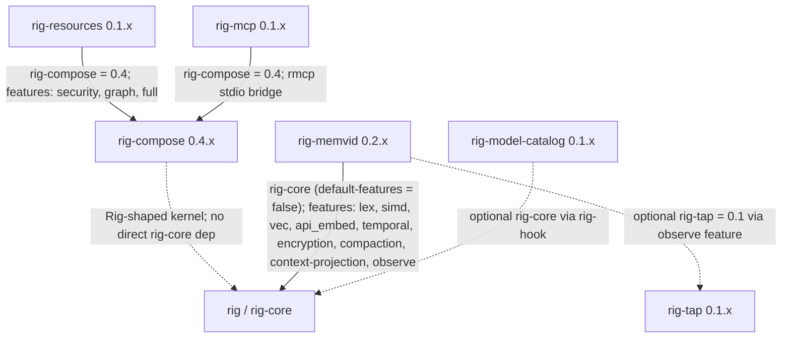

# rig-memvid

Memvid-backed persistent memory and lexical store for Rig agents.

[](https://crates.io/crates/rig-memvid)
[](https://docs.rs/rig-memvid)
[](LICENSE)
[](https://crates.io/crates/rig-core)
[](https://crates.io/crates/memvid-core)

## Overview

`rig-memvid` exposes Memvid's single-file `.mv2` memory format to Rig agents. It provides a persistent `MemvidStore` that implements Rig vector-store traits, a `MemvidPersistHook` that writes prompt turns into the same archive, and an `InMemoryStore<E>` fallback for deterministic no-disk lexical retrieval in tests and offline modes.

The intended production pattern is: write user and assistant turns through `MemvidPersistHook`, then recall from the same `MemvidStore` through Rig dynamic context or direct vector-store queries.

## Why It Exists

Rig already defines provider-agnostic retrieval and prompt-hook traits. Memvid provides a crash-safe `.mv2` archive with lexical, vector, ACL, temporal, and encryption capabilities. `rig-memvid` fills the adapter gap by implementing Rig's `VectorStoreIndex`, `InsertDocuments`, and `PromptHook` flows over Memvid without making callers depend directly on `memvid-core` APIs for common use.

## Status

- Crate version: `0.4.0`.
- Rust edition: 2024.
- MSRV: 1.89.
- Upstream dependency versions are single-sourced in [Cargo.toml](Cargo.toml); the badges above link to crates.io for the current pinned versions of `rig-core` (renamed to `rig` so the historic `use rig::...` paths still work) and `memvid-core`. Both are pulled with `default-features = false`.
- Runtime stance: runtime-agnostic library; `tokio` is only a dev-dependency for tests and examples.
- Platform stance: not supported on `wasm` targets because `memvid-core` requires synchronous file I/O and OS-level file locking.
- `0.2.0` is a breaking release: write-failure handling is now opt-in through
  `MemoryConfig::write_failure`, and `WriteFailureAction` / `WriteFailurePhase`
  are `#[non_exhaustive]`, so exhaustive matches against earlier variants need
  a wildcard arm. The 0.2.x line additionally shipped the default `simd`
  feature, `MemoryConfigBuilder`, principal-aware persistence, structured
  memory-card and context surfaces, Logic Mesh pass-through, shared
  context-projection provenance keys, the `observe` feature, and local-model
  memory examples. See [CHANGELOG.md](CHANGELOG.md) for the per-release
  breakdown.

The crate-local maturity plan lives in [ROADMAP.md](ROADMAP.md). Cross-crate
coordination lives in
[`rig-ecosystem/docs/roadmap.md`](../rig-ecosystem/docs/roadmap.md).

## Feature Flags

| Feature | Default | Enables | Checked by `just check` |
| --- | --- | --- | --- |
| `lex` | yes | Memvid lexical search via `memvid-core/lex`. | default clippy and tests; also in `lex,vec` and `lex,api_embed` clippy combos |
| `simd` | yes | Memvid SIMD distance kernels via `memvid-core/simd`, restoring the upstream default path dropped by `default-features = false`. | default clippy and tests; chained into `vec` and `api_embed` |
| `vec` | no | Memvid local vector search via `memvid-core/vec`. | clippy with `--no-default-features --features "lex,vec"`; tests with the same combo |
| `api_embed` | no | Remote embedding provider support via `memvid-core/api_embed`. | clippy with `--no-default-features --features "lex,api_embed"` |
| `temporal` | no | Temporal track support via `memvid-core/temporal_track`. | not exercised by `just check` |
| `encryption` | no | At-rest encryption via `memvid-core/encryption`. | not exercised by `just check` |
| `compaction` | no | `MemvidDemotionHook` + `MemvidStoringCompactor` adapters onto `rig::memory::DemotionHook` / `rig::memory::Compactor`. Pulls `rig-memory = 0.1`. | clippy + tests with `--no-default-features --features "lex,compaction"` and via `--all-features` |
| `context-projection` | no | Projects `MemvidStore` / `InMemoryStore` retrieval hits plus structured memory cards into `rig_compose::ContextItem`. Pulls `rig-compose = 0.4`. | clippy + tests with `--no-default-features --features "lex,context-projection"` and via `--all-features` |
| `observe` | no | Emits `rig-tap` `ObservabilityEvent`s (`memory.frame_written`, `memory.demoted`, `context.compacted`, `context.sampled`) from `MemvidPersistHook`, `MemvidDemotionHook`, `MemvidStoringCompactor`, and `MemoryCardContext`. Pulls `rig-tap = 0.1`. | covered by `--all-features` |

## Key Types

- [src/store.rs](src/store.rs): `MemvidStore`, the cloneable `Arc<Mutex<Memvid>>` wrapper implementing Rig retrieval and insertion traits. Access to the underlying archive is **serialised through a single mutex**: clones share the lock, so parallel readers must open separate read-only handles (see Gotchas).
- [src/store.rs](src/store.rs): `MemvidStoreBuilder`, with file lifecycle methods, lexical enablement, snippet sizing, ACL context, read-only open, and vector embedder configuration when `vec` is enabled.
- [src/store.rs](src/store.rs): `MemvidFilter`, a Rig `SearchFilter` adapter for `uri`, `scope`, `as_of_frame`, and `as_of_ts` predicates.
- [src/hook.rs](src/hook.rs): `MemvidPersistHook<M>`, a Rig `PromptHook` implementation that writes user prompts and assistant responses into `MemvidStore`.
- [src/hook.rs](src/hook.rs): `MemoryConfig`, `MemoryConfigBuilder`, `WritePolicy`, and `WriteTransform`, which control what gets persisted, commit cadence, default tags, scope URI, principal, structured-extraction toggles, and the optional `observe_conversation_id` correlator surfaced on emitted `memory.frame_written` events. Use `MemoryConfig::builder()` to thread these through fluently.
- [src/hook.rs](src/hook.rs): `WriteFailure`, `WriteFailureAction`, `WriteFailurePhase`, and `WriteFailureCallback` for opt-in handling of persistence failures — default behavior is `WriteFailure::Warn`; switch to `Halt` to fail the turn, or install a `Custom` callback for per-phase telemetry. The `WriteFailure*` enums are `#[non_exhaustive]`.
- [src/inmem.rs](src/inmem.rs): compatibility re-exports for `Episode`, `InMemoryStore<E>`, `InMemoryHit<E>`, and `InMemoryError` from `rig-memory-policy`, preserving the historic no-disk deterministic lexical retrieval surface.
- [src/error.rs](src/error.rs): `MemvidError`, the typed error surface for store, filter, lifecycle, and memvid failures.

Backend-neutral code can import the no-disk reference store directly from
`rig-memory-policy`. Existing callers can keep using `rig_memvid::inmem::*` or
the top-level `rig_memvid::{Episode, InMemoryStore, InMemoryHit, InMemoryError}`
paths; those names are compatibility shims over the policy crate.

When the optional `observe` feature is enabled, `MemvidPersistHook`,
`MemvidDemotionHook`, `MemvidStoringCompactor`, and the memory-card context
sampler emit `rig_tap::ObservabilityEvent`s tagged with the following
`EventKind` variants (recorded as the wire-shape event names noted in
parentheses):

- `EventKind::MemoryFrameWritten` (`memory.frame_written`) — per turn or
  forced-commit write through `MemvidPersistHook` / direct frame writers.
- `EventKind::MemoryDemoted` (`memory.demoted`) — demotion decisions from
  `MemvidDemotionHook`.
- `EventKind::ContextCompacted` (`context.compacted`) — compaction outcomes
  from `MemvidStoringCompactor`.
- `EventKind::ContextSampled` (`context.sampled`) — structured-memory card
  sampling through `MemoryCardContext`.

The crate re-exports `memvid_core` so callers can construct `PutOptions`, `AclContext`, and `SearchRequest` without adding a direct dependency.

## Integration With Rig

`rig-memvid` pins `rig-core` in [Cargo.toml](Cargo.toml). `MemvidStore` plugs into Rig's vector-store flow, including `VectorStoreIndex` and `InsertDocuments`. `MemvidPersistHook<M>` plugs into Rig's prompt lifecycle via `PromptHook<M>` for any `CompletionModel`.

It is community-maintained and not part of the upstream `rig` repository.

## Quick start

Persistent store behavior is covered by [tests/smoke.rs](tests/smoke.rs) and [tests/integration.rs](tests/integration.rs). The examples [examples/chatbot_with_memory.rs](examples/chatbot_with_memory.rs), [examples/chatbot_with_memory_ollama.rs](examples/chatbot_with_memory_ollama.rs), [examples/inspect_memory.rs](examples/inspect_memory.rs), [examples/livetest_relationships.rs](examples/livetest_relationships.rs), and [examples/livetest_relationships_mlx.rs](examples/livetest_relationships_mlx.rs) show end-to-end archive usage. Additional runnable artifacts — [examples/bench_vec_search.rs](examples/bench_vec_search.rs), [examples/harness_record.rs](examples/harness_record.rs), and [examples/mlx_tool_call_normalizer.rs](examples/mlx_tool_call_normalizer.rs) — cover vector-search benchmarking, a tool-dispatch harness recorder, and provider-neutral tool-call normalization respectively.

```rust,no_run
use memvid_core::PutOptions;
use rig::vector_store::{
    request::VectorSearchRequestBuilder, VectorSearchRequest, VectorStoreIndex,
};
use rig_memvid::{MemvidFilter, MemvidStore};

# async fn run() -> Result<(), Box<dyn std::error::Error>> {
let store = MemvidStore::builder()
    .path("./agent_memory.mv2")
    .enable_lex()
    .open_or_create()?;

store.put_text(
    "The Tower of London was founded by William the Conqueror in 1066.",
    PutOptions::default(),
)?;

let request: VectorSearchRequest<MemvidFilter> =
    VectorSearchRequestBuilder::<MemvidFilter>::default()
        .query("Tower of London")
        .samples(5)
        .build();

let hits: Vec<(f64, String, serde_json::Value)> = store.top_n(request).await?;
assert!(!hits.is_empty());
# Ok(()) }
```

The `.mv2` archive lives exactly where the builder path points. In local
development that can be a relative path such as `./agent_memory.mv2`; in a
container or Kubernetes workload it should be a mounted persistent volume path
such as `/var/lib/agent/memory.mv2`. Object stores are useful for snapshots or
backup/restore jobs, but they are not a live `MemvidStore` backend today
because Memvid expects normal filesystem I/O and locking around the active
archive.

### Structured memory (entities, slots, preferences)

`memvid-core` automatically extracts Subject-Predicate-Object triplets,
dates, and topical tags from each frame written through `put_text`
(controlled by `PutOptions::extract_triplets` / `extract_dates` /
`auto_tag`, all on by default — and now mirrored on
`MemoryConfig::extract_triplets`, `extract_dates`, `auto_tag` for the
persistence hook). The resulting `MemoryCard`s form a structured
entity/slot index over the underlying free-text archive, queryable
through:

- `MemvidStore::memory_card_count`
- `MemvidStore::entity_memories(entity)`
- `MemvidStore::current_memory(entity, slot)` — most recent
  non-retracted value
- `MemvidStore::entity_preferences(entity)` — preference-kind cards
- `MemvidStore::aggregate_memory_slot(entity, slot)` — every distinct
  value recorded
- `MemvidStore::memory_timeline(entity)` — event-kind cards in
  chronological order
- `MemvidStore::put_memory_card(card)` — insert a
  hand-rolled `MemoryCard`

`MemoryCard`, `MemoryKind`, `Polarity`, and `VersionRelation` are
re-exported from `rig_memvid` so callers do not need a direct
`memvid-core` dependency to name them. The
`chatbot_with_memory_ollama` example exposes this surface through its
`/entity`, `/prefs`, and `/slot` REPL commands.

### Surfacing cards to the agent

Reading cards from Rust is one half; getting the agent to *use* them is
the other. `MemoryCardContext` is a `VectorStoreIndex` view over the
card track that returns formatted card lines instead of frame text —
wire it as a second `dynamic_context` and the agent sees both episodic
recall (frames) and structured recall (cards), with no model-side
cooperation required:

```rust,no_run
use rig_memvid::{CardSelection, MemoryCardContext, MemvidStore};
# async fn run(store: MemvidStore) -> Result<(), Box<dyn std::error::Error>> {
# let model: rig::providers::openai::CompletionModel = unimplemented!();
let cards = MemoryCardContext::new(store.clone(), CardSelection::EntityMentions);
let agent = rig::agent::AgentBuilder::new(model)
    .dynamic_context(4, store)   // episodic frames
    .dynamic_context(8, cards)   // structured cards
    .build();
# Ok(()) }
```

Selection strategies (`CardSelection`):

- `EntityMentions` (default) — pulls cards for entities whose names
  appear in the query, case-insensitive, word-boundary aware.
  Deterministic, zero-dependency, no NER.
- `RecentCards` — most recently written cards regardless of query.
  Useful as a "what does the agent know about the user right now"
  preamble.
- `ForPrincipal(entity)` — cards for one stable entity regardless of
  query text. Pair with `MemoryConfig::builder().principal(Some(entity))…build()`
  so first-person user turns such as `I like espresso` are persisted as
  that entity's structured memories. Principal selection also expands
  one hop through relationship-card values, so `alice/manager = Bob`
  can surface `bob/reports_to = Carol` for manager/reporting questions.
- `PreferencesFor(entities)` — preference-kind cards for a fixed list
  of entities (typically `["user"]`).

After a strategy selects candidate cards, `MemoryCardContext` ranks them
against the query before applying the result limit. The ranking is
deterministic and local: slot / kind / value matches beat recency, while
recency remains a tie-breaker. This keeps broad principal recall useful
without letting the newest card dominate unrelated questions; for
example, `where` questions prefer `location` cards, food-safety
questions prefer `allergy` cards, and preference questions prefer
preference cards.

For user-profile style archives, set `MemoryConfig::principal` and
`MemoryConfig::persist_assistant = false` to bind first-person user turns to a
stable entity and keep assistant paraphrases from creating duplicate or noisy
cards. The `chatbot_with_memory_ollama` example defaults to this profile-memory
shape with `MEMVID_PRINCIPAL=User` and `MEMVID_PERSIST_ASSISTANT=false`;
override either environment variable when you need a full transcript archive or
a named principal such as `Alice`. With `MemoryConfig::principal` set,
`supplemental_profile_cards` also adds small deterministic cards for common
user-profile and relationship facts that memvid's extractor can miss, such as
`Alice is allergic to peanuts` -> `profile alice/allergy = peanuts` and `Bob is
Alice's manager at Acme. He reports to Carol, the VP.` -> `relationship
alice/manager = Bob`, `relationship bob/reports_to = Carol`, and `profile
carol/title = VP`.

### Projecting memory into compose context

With the optional `context-projection` feature enabled, `rig-memvid` can
project both episodic retrieval hits and structured memory cards into
`rig_compose::ContextItem`s for shared `ContextPack` budgeting. Card
projection preserves compact card text, rank, confidence-or-fallback score,
and provenance fields such as entity, slot, kind, polarity, source frame,
source URI, engine, and schema version.

Projected provenance also emits shared context keys aligned with the
`rig-compose` context vocabulary: `source_uri`, `principal`,
`recorded_at_millis`, `effective_at_millis`, `confidence`,
`source_frame_id`, `version_key`, and `projection_state` where the underlying
memvid source can supply them. Existing memvid-specific keys such as `frame_id`,
`entity`, `slot`, `kind`, `polarity`, `engine`, and `effective_timestamp` remain
in place for compatibility.

When `context-projection` is combined with `compaction`, search hits written by
`MemvidDemotionHook` or `MemvidStoringCompactor` can be projected through
`MemoryContextPack::from_search_hits`. That path decodes the typed frame
envelope, separates demoted messages from compaction summaries, and adds
frame-specific provenance such as `frame_kind`, `conversation_id`, `chat_role`,
`dedup_key`, `scope`, `scope_uri`, and `scope_path`. If a future source emits
retention metadata in `SearchHitMetadata.extra_metadata`, the projection also
normalises `retention_tier` / `retention_class` and `retention_policy` /
`retention` into `retention_tier` and `retention_policy`.

```rust,no_run
use rig_compose::{ContextPack, ContextPackConfig};
use rig_memvid::projection::memory_cards_to_context_items;
use rig_memvid::MemvidStore;

# fn run(store: MemvidStore) -> Result<(), Box<dyn std::error::Error>> {
let cards = store.entity_memories("alice")?;
let items = memory_cards_to_context_items(&cards);
let pack = ContextPack::pack(items, ContextPackConfig::new(2_000));
let prompt_context = pack.render_text();
# let _ = prompt_context;
# Ok(()) }
```

For no-disk tests or offline modes, [src/inmem.rs](src/inmem.rs) includes unit tests for append, lookup, deterministic ranking, zero-score filtering, and Unicode normalization.

```rust,no_run
use rig_memvid::{Episode, InMemoryStore};

#[derive(Clone)]
struct Finding {
    summary: String,
}

impl Episode for Finding {
    fn summary(&self) -> &str {
        &self.summary
    }
}

# async fn run() -> Result<(), Box<dyn std::error::Error>> {
let store = InMemoryStore::<Finding>::new();
store
    .append(Finding {
        summary: "ПОЛЬЗОВАТЕЛЬ logged in".into(),
    })
    .await?;

let hits = store.retrieve_similar("пользователь", 5).await?;
assert_eq!(hits.len(), 1);
# Ok(()) }
```

## Validation

Canonical validation is `just check`.

That recipe runs formatter checks, clippy for default features plus `--no-default-features --features "lex,vec"` and `--no-default-features --features "lex,api_embed"`, then tests for default features, no default features, and `--no-default-features --features "lex,vec"`. The default path includes the `simd` feature.

Examples must also continue to build with `cargo build --examples`.

## Gotchas

- `MemvidStore` uses `std::sync::Mutex`, not `tokio::sync::Mutex`, to remain runtime-agnostic. Guards are always dropped before `.await` points.
- Reads cannot run in parallel through one `MemvidStore` handle because the underlying `Memvid` API takes `&mut self` and every operation goes through a single `std::sync::Mutex` inside the store. Clones of a `MemvidStore` all share that lock. For high-concurrency read workloads, open separate handles with `MemvidStoreBuilder::open_read_only`, which gives each reader its own `Memvid` instance and lets them progress independently.
- `MemvidStore::search` is the raw memvid path. Do not call it from inside a `WriteTransform`; hook writes already go through the same store and a re-entrant call can deadlock.
- `MemvidFilter::gt`, `lt`, and `or` are rejected because they do not map onto memvid's query model.
- The `vec` path only honors `MemvidFilter::scope`; `uri`, `as_of_frame`, and `as_of_ts` are unsupported on vector search.
- `InMemoryStore` is deterministic and implemented in `rig-memory-policy`, but it is lexical token overlap only, not semantic vector retrieval.
- `rig-memvid` intentionally fails to compile on `wasm` targets with a clear message.

## Building from source

The committed `[patch.crates-io]` table in `Cargo.toml` overrides
`rig-compose` and `rig-tap` to sibling checkouts (`../rig-compose`,
`../rig-tap`). `rig-tap` is not yet published to crates.io, so a clean
clone of this repository will not build on its own. Either:

- clone the siblings next to this repo (`git clone https://github.com/ForeverAngry/rig-compose ../rig-compose && git clone https://github.com/ForeverAngry/rig-tap ../rig-tap`), or
- remove the corresponding lines from `[patch.crates-io]` locally (only `rig-compose` is on crates.io today; `rig-tap` will gate the `observe` feature until it is published).

CI mirrors the sibling-clone approach. This file pins the workflow once
`rig-tap` ships on crates.io.

## Ecosystem

These companion crates are maintained as separate repositories. Together they form a small stack around the upstream Rig project: `rig-compose` provides the kernel surface, `rig-resources` contributes reusable skills and tools, `rig-mcp` moves tools across MCP, `rig-memvid` connects Rig agents to persistent `.mv2` memory, `rig-model-catalog` abstracts LLM metadata and probes, and `rig-tap` defines the backend-agnostic `ObservabilityEvent` schema that `rig-memvid` emits from under the `observe` feature.



Pinned Rig-facing dependencies from the current manifests:

| Crate | Direct Rig-facing dependency | Notes |
| --- | --- | --- |
| `rig-compose` | none | Defines a Rig-shaped kernel surface without depending on `rig-core`. |
| `rig-resources` | `rig-compose = 0.4` | Provides reusable skills, resource tools, and security helpers. |
| `rig-mcp` | `rig-compose = 0.4` | Bridges `rig-compose` tools over MCP stdio and loopback transports. |
| `rig-memvid` | `rig-core = 0.37.0`; optional `rig-compose = 0.4`; optional `rig-tap = 0.1` | Implements Rig vector-store, prompt-hook, compaction, context-projection, and (under `observe`) observability-event emission over Memvid. |
| `rig-model-catalog` | optional `rig-core = 0.37` via `rig-hook` | Provides standalone model traits plus optional Rig prompt-hook telemetry. |
| `rig-tap` | `rig-core = 0.37` | Defines the `ObservabilityEvent` schema, `TelemetryHook`, and `ObservedMemory` decorator that `rig-memvid` emits under the `observe` feature. |

The concrete multi-crate workflow tested today is the MCP loopback path: a `rig_compose::ToolRegistry` is exposed through `rig_mcp::LoopbackTransport`, remote schemas are wrapped as `rig_mcp::McpTool`, and the wrapped tools are registered back into another `ToolRegistry`. That proves a local `rig-compose` tool and an MCP-adapted tool are indistinguishable to callers. The backing test is `mcp_tool_indistinguishable_from_local` in [rig-mcp/src/transport.rs](https://github.com/ForeverAngry/rig-mcp/blob/main/src/transport.rs).

## License

[MIT](LICENSE)
